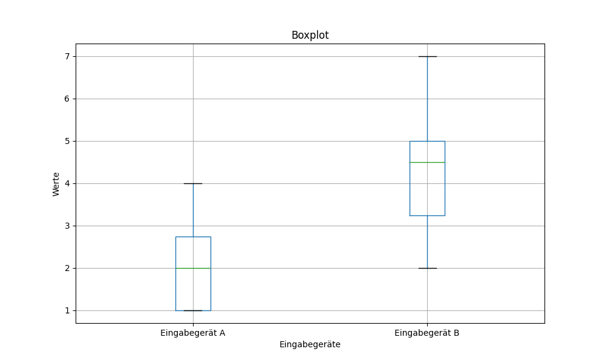

# Quantitative Analysis: Input Device Comparison

## 🎯 Project Overview
This project aims to compare the performance and usability of two different input devices (**Eingabegerät A** and **Eingabegerät B**). Using a dataset of study results, the script generates statistical visualizations to identify trends and performance gaps.

## 📊 Visualizations

### 🔍 Statistical Analysis & Results
Based on the generated boxplot, the study reveals significant differences:

* **Central Tendency (Median):** Eingabegerät A (Median ≈ 2.0) performed significantly better than Eingabegerät B (Median ≈ 4.5).
* **Data Spread (Variance):** Eingabegerät B has a much larger Interquartile Range (IQR), indicating that user performance was inconsistent and highly variable.
* **Range:** * **Eingabegerät A:** Results are tightly clustered between 1.0 and 4.0.
    * **Eingabegerät B:** Results are widely dispersed, ranging from 2.0 to 7.0.
* **Conclusion:** Eingabegerät A is the more efficient and reliable device for this task, producing lower values with higher consistency.

## 🛠️ Tech Stack
- **Language:** Python 3.12.2
- **Libraries:** Pandas, Matplotlib

## 📖 How to Run
1.Clone the repository:
`git clone https://github.com/demgn/Quantitative_analyse.git`
2. Install dependencies:
   `pip install pandas matplotlib`
3. Ensure you have the data file `study_results.csv` in the root folder.
4. Run the script:
   `python main.py`

---
*Developed as part of my Software Engineering studies @ University of Duisburg-Essen.*

